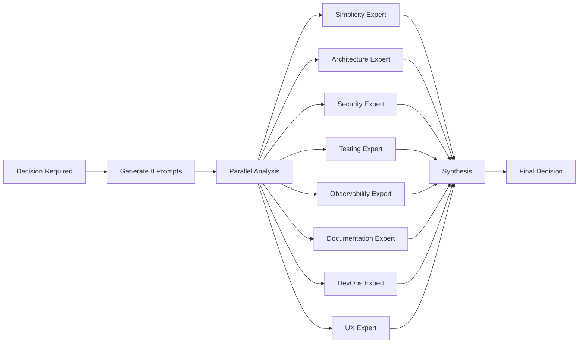

# Core Concepts

This guide provides a deeper understanding of RecursiveManager's fundamental concepts and how they work together.

::: warning Development Status
RecursiveManager is in active development. APIs and behaviors may change between releases.
:::

## Agent Hierarchy

RecursiveManager organizes agents in a hierarchical structure, mimicking how real organizations work.

### The CEO Pattern

Every RecursiveManager system starts with a **root agent** (commonly called the CEO):

```
CEO (Root)
├── CTO
│   ├── Backend Developer
│   └── Frontend Developer
└── CFO
    └── Accounting Agent
```

Key properties:
- **Root agents** have no manager (`reporting_to: NULL`)
- **All other agents** report to exactly one manager
- **Multi-level hierarchies** are fully supported (no depth limit in theory, but practical limits apply)
- **Traversal** can go up (to manager) or down (to subordinates)

### Agent Relationships

The `agents` table tracks relationships:

```typescript
interface Agent {
  id: string;              // e.g., "cto-001"
  display_name: string;    // e.g., "CTO"
  role: string;            // e.g., "Chief Technology Officer"
  reporting_to: string;    // Manager's ID (NULL for root)
  status: 'active' | 'paused' | 'fired';
  created_at: Date;
}
```

### Org Hierarchy View

RecursiveManager maintains a materialized view (`org_hierarchy`) that stores the transitive closure of the hierarchy:

```typescript
interface OrgHierarchy {
  agent_id: string;        // Current agent
  ancestor_id: string;     // Any ancestor (manager, grandmanager, etc.)
  depth: number;           // Distance (0=self, 1=manager, 2=grandparent)
  path: string;            // "CEO/CTO/backend-dev-001"
}
```

This enables efficient queries like:
- "Who are all the ancestors of agent X?" (for permission checks)
- "Who reports to manager Y at any level?" (for org chart display)
- "What's the full path from root to agent Z?" (for context)

## Task Delegation

Tasks flow through the hierarchy, enabling work to be delegated and coordinated.

### Task Lifecycle

```
pending → in-progress → completed
            ↓
         blocked → (unblocked) → in-progress
            ↓
         archived
```

### Task Structure

```typescript
interface Task {
  id: string;               // e.g., "task-1-20260119-143000-abc123"
  agent_id: string;         // Currently responsible agent
  title: string;            // Brief description
  status: 'pending' | 'in_progress' | 'blocked' | 'completed' | 'archived';
  delegated_to: string;     // Current assignee
  parent_task_id?: string;  // For subtasks
  blocked_by: string[];     // Array of blocking task IDs
  percent_complete: number; // 0-100%
  priority: 'low' | 'normal' | 'high' | 'urgent';
  version: number;          // Optimistic locking
}
```

### Delegation Flow

1. **CEO creates task**: "Build user authentication system"
2. **CEO delegates to CTO**: Task moves to CTO's inbox
3. **CTO breaks into subtasks**:
   - "Design authentication schema" (Backend Dev)
   - "Create login UI" (Frontend Dev)
4. **Developers work on subtasks**: Report progress updates
5. **CTO monitors completion**: Parent task completes when all subtasks done

### Task Blocking

Tasks can be blocked by multiple factors:

```typescript
interface BlockingReason {
  type: 'dependency' | 'pause' | 'approval' | 'resource';
  blocking_task_ids?: string[];   // For dependencies
  reason?: string;                 // Human-readable explanation
}
```

Example blocking scenarios:
- **Dependency**: "Frontend UI blocked by backend API completion"
- **Pause**: "All tasks blocked because agent is paused"
- **Approval**: "Deployment blocked pending manager approval"
- **Resource**: "Task blocked due to insufficient disk space"

### Progress Tracking

Parent task progress is automatically calculated:

```typescript
function calculateProgress(task: Task): number {
  if (task.subtasks.length === 0) {
    return task.percent_complete;
  }

  const subtaskTotal = task.subtasks
    .map(st => calculateProgress(st))
    .reduce((sum, pct) => sum + pct, 0);

  return subtaskTotal / task.subtasks.length;
}
```

## Multi-Perspective Analysis

Before major decisions, RecursiveManager analyzes from 8 expert perspectives.

### The 8 Perspectives

1. **Simplicity & Developer Experience**: Is this maintainable and easy to use?
2. **Architecture & Scalability**: Will this scale and integrate well?
3. **Security & Trust**: What are the security implications?
4. **Testing & Quality Assurance**: How do we verify this works?
5. **Observability & Debugging**: Can we monitor and troubleshoot this?
6. **Documentation & Onboarding**: Is this understandable for users?
7. **DevOps & Operations**: Can we deploy and maintain this?
8. **User Experience**: How does this affect end users?

### Analysis Workflow



### Decision Synthesis

Each perspective provides:
- **Recommendation**: approve | reject | modify
- **Confidence**: 0.0 - 1.0
- **Reasoning**: Why this recommendation?
- **Concerns**: What could go wrong?

The synthesis engine combines these:

```typescript
interface Decision {
  recommendation: 'approve' | 'reject' | 'needs_modification';
  confidence: number;        // 0.0 - 1.0
  perspectiveResults: PerspectiveResult[];
  warnings: string[];        // Aggregated concerns
  reasoning: string;         // Final justification
}
```

### When Multi-Perspective Is Used

- **Hiring decisions**: "Should I hire a new developer?"
- **Architecture changes**: "Should we switch to microservices?"
- **Firing decisions**: "Should I fire this underperforming agent?"
- **Major refactoring**: "Should we rewrite this module?"

See [Multi-Perspective Analysis](/guide/multi-perspective) for complete details.

## Agent Lifecycle

Agents transition through states during their lifetime.

### Agent States

```
   created → active
              ↓
            paused ←→ active
              ↓
            fired (terminal)
```

### State Descriptions

- **Active**: Agent is working on tasks and accepting new work
- **Paused**: Agent is temporarily stopped (all tasks blocked)
- **Fired**: Agent is permanently removed (cannot be resumed)

### Lifecycle Operations

#### 1. Hiring (`hireAgent`)

Process:
1. **Validation**: Check manager permissions, budget, hierarchy depth
2. **Filesystem**: Create agent directory structure
3. **Database**: Insert agent record + org_hierarchy entries
4. **Configuration**: Write config.json, schedule.json, metadata.json
5. **Parent Updates**: Update manager's subordinates registry
6. **Snapshot**: Create database backup for rollback

Directory structure created:
```
agents/cto-001/
├── config.json          # Agent identity and permissions
├── schedule.json        # Execution schedule
├── metadata.json        # Runtime statistics
├── tasks/
│   ├── active/          # Current tasks
│   ├── completed/       # Finished tasks
│   └── archive/         # Old tasks
├── inbox/
│   ├── unread/          # New messages
│   └── read/            # Processed messages
├── outbox/
│   ├── pending/         # Queued messages
│   └── sent/            # Delivered messages
├── workspace/           # Scratch space for work
└── subordinates/        # Registry of direct reports
```

#### 2. Pausing (`pauseAgent`)

Process:
1. **Status Update**: Set agent status to 'paused'
2. **Task Blocking**: Block all active tasks with `PAUSE_BLOCKER` flag
3. **Audit Log**: Record pause action
4. **Notification**: Send message to agent and manager

Paused agents:
- Cannot execute tasks
- Continue receiving messages
- Can be resumed anytime
- Subordinates continue working (unless also paused)

#### 3. Resuming (`resumeAgent`)

Process:
1. **Status Update**: Set agent status to 'active'
2. **Task Unblocking**: Remove `PAUSE_BLOCKER` from tasks (preserving other blockers)
3. **Audit Log**: Record resume action
4. **Notification**: Send message to agent and manager

#### 4. Firing (`fireAgent`)

Process:
1. **Orphan Handling**: Apply strategy (reassign/promote/cascade)
2. **Task Reassignment**: Move tasks to manager or archive
3. **Status Update**: Set agent status to 'fired'
4. **Notifications**: Inform fired agent, manager, and subordinates
5. **Archive Files**: Move agent directory to `backups/fired-agents/`
6. **Database Update**: Remove from org_hierarchy (keep audit log)
7. **Snapshot**: Create database backup for recovery

Orphan handling strategies:
- **Reassign**: Move subordinates to fired agent's manager
- **Promote**: Promote one subordinate to replace fired agent
- **Cascade**: Fire all subordinates recursively

## Task Management

### Task Storage

Tasks use hybrid storage:

**Database**: Metadata for fast queries
```sql
SELECT * FROM tasks
WHERE agent_id = 'cto-001'
  AND status = 'in_progress'
ORDER BY priority DESC;
```

**Filesystem**: Full content for readability
```
tasks/active/task-1-20260119/
├── plan.md           # Task plan
├── progress.md       # Current progress
├── subtasks.md       # Checklist
└── context.json      # Metadata
```

### Task Depth

Tasks can be nested up to 5 levels deep:

```
task-1                    # Depth 0: "Build authentication"
└── task-2                # Depth 1: "Implement OAuth"
    └── task-3            # Depth 2: "Add Google provider"
        └── task-4        # Depth 3: "Configure credentials"
            └── task-5    # Depth 4: "Test authentication flow"
                └── ❌    # Depth 5 not allowed
```

Limit prevents infinite recursion and keeps tasks manageable.

### Task Dependencies

Tasks can depend on other tasks:

```typescript
interface Task {
  blocked_by: string[];  // ["task-123", "task-456"]
}
```

Example:
```
task-1: "Deploy to production"
  blocked_by: ["task-2"]

task-2: "Run integration tests"
  blocked_by: ["task-3", "task-4"]

task-3: "Implement feature A"
  blocked_by: []

task-4: "Implement feature B"
  blocked_by: []
```

Task-1 cannot start until tasks 2, 3, and 4 all complete.

### Deadlock Detection

RecursiveManager detects circular dependencies:

```
task-1 blocked by task-2
task-2 blocked by task-3
task-3 blocked by task-1  ❌ Deadlock!
```

When detected:
1. Warning logged
2. Manager notified
3. Tasks flagged for manual intervention

## Inter-Agent Communication

Agents communicate via a message system.

### Message Structure

```typescript
interface Message {
  id: string;
  from_agent_id: string;
  to_agent_id: string;
  subject: string;
  content: string;         // Markdown
  priority: 'low' | 'normal' | 'high' | 'urgent';
  channel: 'internal' | 'slack' | 'telegram' | 'email';
  read: boolean;
  action_required: boolean;
  created_at: Date;
}
```

### Message Flow

1. **Send**: Agent A creates message for Agent B
2. **Delivery**: Message written to Agent B's `inbox/unread/`
3. **Notification**: Agent B notified (if reactive mode enabled)
4. **Read**: Agent B reads message, moves to `inbox/read/`
5. **Response**: Agent B optionally replies, creating new message

### Storage Hybrid

**Database**: Metadata for queries
```sql
SELECT * FROM messages
WHERE to_agent_id = 'cto-001'
  AND read = 0
ORDER BY priority DESC, created_at ASC;
```

**Filesystem**: Full content in markdown
```
agents/cto-001/inbox/unread/msg-abc123.md
agents/cto-001/inbox/read/msg-def456.md
agents/cto-001/outbox/sent/msg-ghi789.md
```

### Message Channels

- **Internal**: Between agents in same system (always available)
- **Slack**: Integration with Slack workspace (requires webhook)
- **Telegram**: Integration with Telegram bot (requires token)
- **Email**: Email notifications (requires SMTP config)

## Execution Model

RecursiveManager uses a worker pool to execute agents concurrently.

### Execution Pool

```typescript
interface ExecutionPool {
  maxConcurrent: number;   // Default: 10
  activeAgents: Set<string>;
  queuedTasks: AgentTask[];
  statistics: {
    totalExecutions: number;
    successRate: number;
    avgWaitTime: number;
  };
}
```

### Worker Pool Pattern

```
Active Pool [10 slots]:
┌──────────────────────────────────┐
│ Agent1 Agent2 Agent3 ... Agent10 │
└──────────────────────────────────┘

Queued [FIFO]:
┌──────────────────────────────────┐
│ Agent11 → Agent12 → Agent13 ...  │
└──────────────────────────────────┘

When Agent1 completes:
  Agent11 moves to Active Pool
```

### Execution Modes

#### 1. Continuous Mode

Agent actively checks for tasks:

```json
{
  "mode": "continuous",
  "continuous": {
    "enabled": true,
    "minIntervalSeconds": 300,
    "maxIntervalSeconds": 3600,
    "runOnlyWhenTasksPending": true
  }
}
```

Behavior:
- Runs every 5-60 minutes (adaptive based on load)
- Only runs if tasks pending (configurable)
- Picks highest priority task from queue

#### 2. Reactive Mode

Agent responds to messages:

```json
{
  "mode": "reactive",
  "reactive": {
    "enabled": true,
    "pollIntervalSeconds": 60,
    "channels": ["slack", "telegram", "internal"]
  }
}
```

Behavior:
- Polls message channels every 60 seconds
- Processes unread messages
- Can create tasks or delegate work

#### 3. Hybrid Mode (Recommended)

Combines both modes:

```json
{
  "mode": "hybrid",
  "continuous": { "enabled": true },
  "reactive": { "enabled": true }
}
```

## Configuration System

Each agent has three configuration files:

### 1. config.json

Core agent identity and permissions:

```json
{
  "identity": {
    "agentId": "cto-001",
    "role": "Chief Technology Officer",
    "displayName": "CTO",
    "createdAt": "2026-01-19T14:30:00Z"
  },
  "goal": {
    "main": "Manage engineering team and deliver high-quality software",
    "subGoals": [
      "Hire and manage development team",
      "Ensure code quality and testing standards",
      "Coordinate releases and deployments"
    ],
    "successCriteria": [
      "All features delivered on time",
      "Test coverage above 95%",
      "Zero critical bugs in production"
    ]
  },
  "permissions": {
    "canHire": true,
    "maxSubordinates": 10,
    "hiringBudget": 5,
    "canFireSubordinates": true,
    "canDelegateToOthers": false
  }
}
```

### 2. schedule.json

Execution schedule:

```json
{
  "mode": "hybrid",
  "continuous": {
    "enabled": true,
    "minIntervalSeconds": 300,
    "maxIntervalSeconds": 3600,
    "runOnlyWhenTasksPending": true,
    "pauseConditions": {
      "businessHoursOnly": false,
      "pauseOnWeekends": false
    }
  },
  "timeBased": {
    "enabled": true,
    "schedules": [
      {
        "cron": "0 9 * * MON-FRI",
        "timezone": "America/New_York",
        "description": "Daily standup at 9 AM EST"
      }
    ]
  },
  "reactive": {
    "enabled": true,
    "pollIntervalSeconds": 60,
    "channels": ["slack", "internal"]
  }
}
```

### 3. metadata.json

Runtime statistics (auto-updated):

```json
{
  "runtime": {
    "currentStatus": "active",
    "lastExecutionAt": "2026-01-19T15:45:00Z",
    "nextScheduledAt": "2026-01-19T16:00:00Z"
  },
  "statistics": {
    "totalExecutions": 145,
    "successfulExecutions": 142,
    "failedExecutions": 3,
    "averageRuntimeSeconds": 23.5,
    "tasksCompleted": 87,
    "messagesSent": 203,
    "messagesReceived": 156
  },
  "health": {
    "healthScore": 98.5,
    "lastHealthCheck": "2026-01-19T15:45:00Z",
    "issues": [],
    "warnings": ["High task queue depth (45 tasks)"]
  }
}
```

## Audit Logging

All actions are logged immutably.

### Audit Log Structure

```typescript
interface AuditLog {
  id: string;
  timestamp: Date;
  agent_id: string;         // Who performed action
  action: 'hire' | 'fire' | 'execute' | 'delegate' | 'message' | 'pause' | 'resume';
  target_agent_id?: string; // Who was affected
  success: boolean;
  details: any;             // JSON with context
}
```

### Immutability

The audit log is **append-only**:
- No UPDATE statements allowed
- No DELETE statements allowed
- SQLite trigger enforces immutability
- Full action history preserved forever

### Example Log Entries

```json
[
  {
    "timestamp": "2026-01-19T14:30:00Z",
    "agent_id": "ceo-001",
    "action": "hire",
    "target_agent_id": "cto-001",
    "success": true,
    "details": {
      "role": "Chief Technology Officer",
      "reason": "Need technical leadership"
    }
  },
  {
    "timestamp": "2026-01-19T15:15:00Z",
    "agent_id": "cto-001",
    "action": "delegate",
    "target_agent_id": "backend-dev-001",
    "success": true,
    "details": {
      "task_id": "task-1-20260119-151500-abc",
      "task_title": "Implement OAuth API"
    }
  },
  {
    "timestamp": "2026-01-19T16:00:00Z",
    "agent_id": "ceo-001",
    "action": "fire",
    "target_agent_id": "cto-001",
    "success": true,
    "details": {
      "reason": "Performance issues",
      "orphan_strategy": "reassign"
    }
  }
]
```

## Snapshot System

RecursiveManager creates database snapshots for rollback.

### When Snapshots Are Created

Automatically on:
- Agent hiring: "Agent hired: cto-001 (Chief Technology Officer)"
- Agent firing: "Agent fired: cto-001 (strategy: reassign)"

Manually via:
```bash
ralph rollback --history  # View snapshots
ralph rollback snapshot-id  # Restore from snapshot
```

### Snapshot Structure

```typescript
interface Snapshot {
  id: string;              // "snapshot-20260119-143000-abc123"
  created_at: Date;
  reason: string;          // "Agent hired: cto-001"
  agent_id?: string;       // Related agent (if applicable)
  schema_version: number;  // Database schema version
  size_bytes: number;      // Snapshot file size
}
```

### Snapshot Storage

```
data/snapshots/
├── snapshot-20260119-143000-abc123.db       # SQLite backup
└── snapshot-20260119-143000-abc123.json     # Metadata
```

### Rollback Process

1. **List snapshots**: `ralph rollback --history`
2. **Select snapshot**: Interactive or via ID
3. **Validate integrity**: Check SQLite integrity
4. **Create backup**: Backup current state before restore
5. **Restore**: Overwrite database with snapshot
6. **Verify**: Confirm restoration successful

## Best Practices

### Hierarchy Design

✅ **Do**:
- Keep hierarchies 3-5 levels deep
- Use clear, descriptive role names
- Define specific goals for each agent
- Limit subordinates to 5-10 per manager

❌ **Don't**:
- Create overly deep hierarchies (>7 levels)
- Use generic roles like "Agent 1", "Agent 2"
- Create agents without clear goals
- Overload managers with 20+ direct reports

### Task Management

✅ **Do**:
- Break large tasks into manageable subtasks
- Set realistic priorities
- Use task dependencies to sequence work
- Monitor progress regularly

❌ **Don't**:
- Create monolithic tasks that take weeks
- Mark everything as "urgent" priority
- Create circular task dependencies
- Let blocked tasks accumulate

### Communication

✅ **Do**:
- Use descriptive message subjects
- Mark urgent messages appropriately
- Respond to messages promptly
- Use action_required flag for tasks needing attention

❌ **Don't**:
- Send vague messages without context
- Abuse "urgent" priority
- Let messages pile up unread
- Use messages for data storage

## What's Next?

Now that you understand the core concepts, explore specific topics:

- **[Creating Agents](/guide/creating-agents)** - Hiring, roles, and manager relationships
- **[Task Management](/guide/task-management)** - Lifecycle, blocking, and deadlock detection
- **[Scheduling](/guide/scheduling)** - Cron, time-based, and recurring tasks
- **[Messaging](/guide/messaging)** - Inter-agent communication and channels
- **[Multi-Perspective Analysis](/guide/multi-perspective)** - Deep dive into the 8 perspectives
- **[Framework Adapters](/guide/framework-adapters)** - Adapter architecture and custom adapters
- **[Best Practices](/guide/best-practices)** - Hierarchy design and error handling
- **[Troubleshooting](/guide/troubleshooting)** - Common errors and solutions

Or jump to architecture documentation:

- **[System Design](/architecture/system-design)** - Overall architecture with diagrams
- **[Execution Model](/architecture/execution-model)** - Worker pool and concurrency
- **[Database Schema](/api/schemas)** - All tables and relationships
